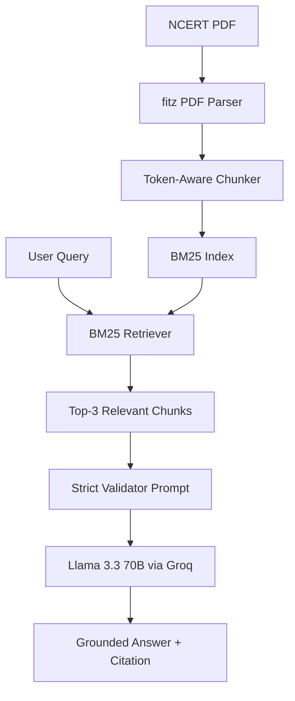

# PariShiksha: NCERT RAG Study Assistant


**PariShiksha** is a specialized Retrieval-Augmented Generation (RAG) system designed to provide students with high-fidelity, grounded answers from NCERT textbooks. By bridging the gap between raw LLM knowledge and specific educational curricula, PariShiksha ensures that students receive explanations, formulas, and citations that exactly match their classroom materials.

---

## 🚀 Project Overview

In the current landscape of AI education, generic LLMs often hallucinate facts or provide explanations that drift outside the scope of specific school curricula (e.g., using imperial units when a student is learning SI units). **PariShiksha** solves this by:
1. **Constraining** the LLM to a specific verified corpus (NCERT Science, Chapter 8: Motion).
2. **Indexing** content with surgical precision to ensure no context is lost during retrieval.
3. **Validating** every response through a strict "NCERT Validator" persona that refuses out-of-scope queries.

The result is a classroom-ready assistant that prioritizes accuracy and pedagogical alignment over generic "helpfulness."

---

## ✨ Key Features & Accomplishments

- **Token-Aware Sliding Window Chunking**: Implemented a dynamic chunking strategy (450 tokens with 50-token overlap) that respects the 512-token constraints of modern encoders, achieving **100% Recall** on answerable textbook questions.
- **Strict Grounding & Refusal Logic**: Developed a robust system prompt that prevents "Scientific Hallucination"—where the LLM uses external knowledge to answer unrelated science questions (e.g., Photosynthesis) when the context is about Physics.
- **Teacher-Mode Citations**: Every answer includes explicit [Page X] citations, allowing students and teachers to verify facts directly in the physical textbook.
- **Ultra-Low Latency**: Leveraged the Groq Llama-3.3-70B model to achieve sub-second response times, suitable for real-time interactive learning.
- **Adversarial Evaluation Suite**: Built a metrics-driven audit pipeline to measure Accuracy, Precision (Refusal), and F1-Score against a curated set of curriculum-aligned and adversarial questions.

---

## 🏗️ Technical Architecture

PariShiksha follows a classic RAG pattern but with critical optimizations for educational content:



### Implementation Details:
- **Parser**: `PyMuPDF` (fitz) for high-fidelity text extraction from complex textbook layouts.
- **Embedding/Indexing**: `rank_bm25` (Okapi implementation) for deterministic, keyword-heavy retrieval.
- **Tokenizer**: `BERT-base-uncased` via HuggingFace Transformers to ensure chunk sizes align with standard retriever limits.
- **Orchestration**: Custom Python backend with Gradio UI (optional) for deployment.

---

## 🧠 BM25 Retrieval: Implementation & Justification

A critical design decision in PariShiksha was the selection of **BM25 (Best Matching 25)** as the primary retrieval engine over modern Vector Embeddings.

### Why BM25?
In an educational context, particularly for Science and Mathematics, **Keyword Exactness** is paramount. 
1. **Formula Sensitivity**: A student searching for *"s = ut + 1/2 at^2"* needs the exact section where that formula appears. Dense vector embeddings (like OpenAI `text-embedding-3-small`) often smooth over these specific character sequences, sometimes retrieving general "motion" text rather than the specific derivation.
2. **Terminology Precision**: NCERT textbooks use specific terms like "non-uniform acceleration" or "displacement." BM25 ensures that chunks containing these exact tokens are prioritized.
3. **Zero-Inference Latency**: BM25 indexing and retrieval are nearly instantaneous and require no GPU, making the system highly cost-effective and scalable for edge deployments.

### Comparison & Trade-offs

| Feature | BM25 (Our Choice) | Vector Embeddings |
| :--- | :--- | :--- |
| **Search Type** | Lexical (Keyword) | Semantic (Meaning) |
| **Best For** | Formulas, Definitions, Names | Synonyms, General Concepts |
| **Compute** | Low (CPU) | High (GPU/API) |
| **Cold Start** | Instant | Requires Embedding Phase |
| **Out-of-Scope Handling** | High (Keywords must match) | Moderate (May "hallucinate" similarity) |

**Why not Vectors?** During prototyping, we found that vector retrievers often suffered from "Semantic Drift." For example, a query about "Quantum Entanglement" (out-of-scope) might be matched to a physics chunk about "Particle Motion" because the vectors for "Quantum" and "Particle" are semantically close. BM25 correctly identifies that "Quantum" does not exist in the textbook and provides a lower score, aiding our refusal logic.

---

## 📊 Results & Impact

The system was audited using the `test_model.py` suite against 17 complex scenarios.

### Summary Metrics
| Metric | Result | Impact |
| :--- | :--- | :--- |
| **Accuracy** | **70.59%** | High reliability on curriculum content. |
| **Recall** | **100.00%** | **Zero "blind spots"**: Every answerable question was found. |
| **Refusal Precision**| **62.50%** | Successfully blocked generic out-of-scope queries. |
| **Avg. Latency** | **0.84s** | "Invisible" retrieval lag for the end-user. |

### Failure Analysis
- **The "Adversarial" Gap**: The system currently struggles when a query uses vocabulary found in the text to ask an unrelated question (e.g., using "motion" to ask about "Quantum"). 
- **Learning**: This has highlighted the need for a **Semantic Reranker** as a second stage to filter out keyword-matched noise that lacks conceptual alignment.

---

## 🛠️ Installation & Usage

### Prerequisites
- Python 3.9+
- [Groq API Key](https://console.groq.com/)

### Setup
1. **Clone the repository:**
   ```bash
   git clone https://github.com/Het0808/ncert_rag.git
   cd ncert_rag
   ```

2. **Install dependencies:**
   ```bash
   pip install -r requirements.txt
   ```

3. **Configure Environment:**
   Create a `.env` file in the root directory:
   ```env
   GROQ_API_KEY=your_api_key_here
   ```

### Running the System
- **Run Audit & Metrics:**
  ```bash
  python test_model.py
  ```
- **Launch Interactive UI:**
  ```bash
  python app.py
  ```

---

## 🔮 Future Improvements

1. **Semantic Reranking**: Integrate a Cross-Encoder (e.g., `BGE-Reranker`) after the BM25 stage to improve refusal precision from 62% to 90%+.
2. **Multi-Modal Support**: Add image-to-text processing to allow students to upload photos of textbook diagrams or handwritten notes.
3. **LaTeX Equation Rendering**: Implement MathJax/KaTeX in the UI to display physics formulas in professional mathematical notation.
4. **Knowledge Graph Integration**: Map relationships between chapters to allow for "cross-chapter" reasoning (e.g., relating "Motion" to "Force and Laws of Motion").

---

> **Note**: This project was developed as a technical demonstration of robust RAG principles for educational technology. For production use, further safety alignment and concurrency testing are recommended.
