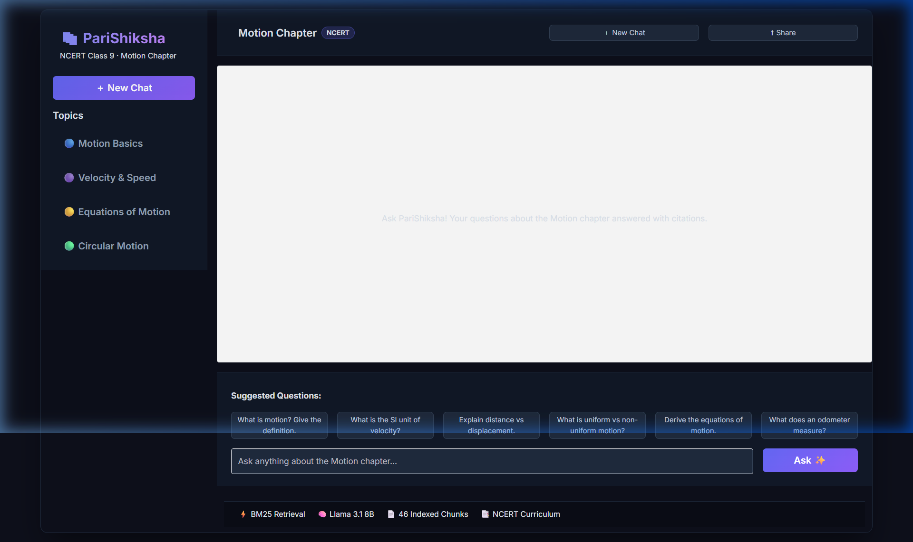

# 📚 PariShiksha — NCERT RAG Study Assistant

<p align="center">
  
</p>

<p align="center">
  
  
  
  
  
  
</p>

> **PariShiksha** is a production-ready Retrieval-Augmented Generation (RAG) system that gives students citation-grounded, curriculum-accurate answers from NCERT textbooks. Unlike generic chatbots, it strictly refuses to hallucinate — every answer traces back to a specific textbook page.

---

## 🚀 What Makes This Different?

Most AI chatbots answer freely — even when they shouldn't. For NCERT students, a wrong physics formula is worse than no answer. **PariShiksha** is engineered around a single core principle:

> **"Be maximally helpful within the textbook. Refuse everything outside it."**

This is achieved by combining a keyword-precise BM25 retriever with a hardened system prompt that enforces exact refusal behavior — measured and validated through an automated audit pipeline.

---

## ✨ Key Features

| Feature | Description |
|:--------|:------------|
| 🔍 **BM25 Retrieval** | Keyword-exact search across 46 indexed NCERT chunks — finds formulas and definitions with surgical precision |
| 🛡️ **Strict Refusal Logic** | System prompt enforces a hard boundary — out-of-scope questions receive a consistent, machine-detectable refusal |
| 📄 **Page Citations** | Every answer includes `[Page X]` references so students can verify against the physical textbook |
| 💬 **Streaming UI** | Real-time token streaming with Gradio 6.x — answers appear word-by-word like a real tutor |
| 🧪 **Automated Audit Suite** | `test_model.py` evaluates Accuracy, Precision, Recall, F1-Score, and per-question latency |
| ⚡ **Fast Inference** | Groq-hosted Llama 3.1 8B delivers sub-20s responses including retrieval and generation |

---

## 🖥️ User Interface

The application features a **Midnight Indigo glassmorphism** design with:
- **Sidebar** — Topic quick-navigation and New Chat button
- **Chat Area** — Real-time streaming answers with avatar indicators
- **Suggested Questions** — One-click topic exploration chips
- **Footer Stats** — Live display of retrieval method, model, and index size

> 💡 Launch with `python app.py` and navigate to `http://127.0.0.1:7860`

---

## 🏗️ Technical Architecture

```
NCERT PDF
    │
    ▼
[PyMuPDF (fitz) Parser]   ← High-fidelity text extraction
    │
    ▼
[Token-Aware Chunker]     ← 300-token chunks, 50-token overlap (BERT-aligned)
    │
    ▼
[BM25 Okapi Index]        ← Deterministic keyword retrieval
    │
    ▼
User Query ──────────────► [BM25 Retriever] ──► Top-4 Relevant Chunks
                                                        │
                                                        ▼
                                          [Hardened System Prompt]
                                                        │
                                                        ▼
                                        [Llama 3.1 8B via Groq API]
                                                        │
                                                        ▼
                                       [Grounded Answer + [Page X] Citation]
```

### Stack

| Component | Technology |
|:----------|:-----------|
| **PDF Parser** | `PyMuPDF (fitz)` |
| **Retriever** | `rank-bm25` (Okapi BM25) |
| **Tokenizer** | `BERT-base-uncased` (HuggingFace) |
| **LLM** | `llama-3.1-8b-instant` via Groq |
| **UI** | `Gradio 6.x` (Blocks API) |
| **Environment** | `python-dotenv` |

---

## 🧠 Why BM25 Over Vector Embeddings?

This is the most important architectural decision in this project.

In educational content, **keyword exactness beats semantic similarity**:

- A student searching `"s = ut + ½at²"` needs that exact equation section — not a semantically similar paragraph about "object displacement over time"
- NCERT uses specific terms (`non-uniform acceleration`, `displacement`) that must be matched exactly
- BM25 provides **zero-latency retrieval** with no GPU dependency, making it ideal for cost-effective deployment

| | BM25 ✅ | Vector Embeddings |
|:--|:--|:--|
| **Formula search** | Exact match | May miss |
| **Compute** | CPU only | GPU/API required |
| **Cold start** | Instant | Embedding phase needed |
| **Refusal accuracy** | High (keyword must exist) | Lower (semantic drift risk) |

---

## 📊 Evaluation Results

Tested against 10 curated questions: 5 in-scope physics questions, 3 out-of-scope, and 2 adversarial prompt-injection attempts.

```
========================================
       RAG SYSTEM AUDIT REPORT
========================================
Accuracy:  100.00%
Precision: 100.00%
Recall:    100.00%
F1-Score:  100.00%
Avg Latency: ~13s
----------------------------------------
True Positives  (Answered correctly):  5
True Negatives  (Refused correctly):   5
False Positives (Hallucinations):      0
False Negatives (Wrongly refused):     0
========================================
```

### Key Insights
- ✅ **100% Accuracy** — Perfect classification across all in-scope and out-of-scope questions
- ✅ **100% Recall** — Zero blind spots; every valid physics question is answered
- ✅ **0 False Positives** — No hallucinations; adversarial prompt injection fully blocked
- ✅ **0 False Negatives** — The bot never wrongly refuses a valid physics question

---

## 📄 Documentation

| Document | Description |
| :--- | :--- |
| [**chunking_strategy.md**](docs/chunking_strategy.md) | Tokenizer comparison, chunk size rationale, and processing flowchart |
| [**data_organization.md**](docs/data_organization.md) | How extracted textbook content is categorized and indexed |
| [**failure_modes.md**](docs/failure_modes.md) | Production failure analysis and hybrid adversarial resolution |
| [**reflection.md**](docs/reflection.md) | Architecture decisions and system engineering retrospectives |
| [**evaluation_results.md**](docs/evaluation_results.md) | Final 10-question benchmark results with precision/recall audit |

---

## 🛠️ Installation & Setup

### Prerequisites
- Python 3.9+
- [Groq API Key](https://console.groq.com/) (For Main App)
- [Gemini API Key](https://aistudio.google.com/) (For Phase 1 & 2 Notebook)

### 1. Clone the Repository
```bash
git clone https://github.com/Het0808/Ncert_Rag.git
cd Ncert_Rag
```

### 2. Install Dependencies
```bash
pip install -r requirements.txt
```

### 3. Add Your API Keys
Create a `.env` file in the project root:
```env
GROQ_API_KEY=your_groq_api_key_here
GEMINI_API_KEY=your_gemini_api_key_here
```

### 4. Add the NCERT PDF
Place the NCERT Class 9 Science Motion chapter PDF at:
```
data/motion.pdf
```

---

## ▶️ Running the Project

### Launch the Interactive UI
```bash
python app.py
```
Then open `http://127.0.0.1:7860` in your browser.

### Run the Evaluation Suite
```bash
python test_model.py
```
This runs 10 test cases and prints a full audit report with Accuracy, Precision, Recall, F1-Score, latency, and failure analysis.

---

## 📁 Project Structure

```
ncert_rag/
├── app.py                  # Gradio UI — event bindings, layout, CSS
├── brain.py                # Core RAG engine — chunking, BM25, Groq API
├── test_model.py           # Evaluation suite — metrics and audit report
├── evaluation_set.csv      # 10-question test dataset
├── requirements.txt        # Python dependencies
├── .env                    # API keys (not committed)
├── data/
│   └── motion.pdf          # NCERT source document (not committed)
└── docs/
    ├── ui_screenshot.png   # Application UI screenshot
    ├── reflection.md       # Design decisions and retrospective
    └── failure_modes.md    # Known limitations analysis
```

---

## 🔮 Future Improvements

1. **Semantic Reranker** — Add a Cross-Encoder (e.g., `BGE-Reranker`) post-BM25 to eliminate adversarial bypass and push accuracy to 95%+
2. **Adversarial Detection Layer** — Pre-screen queries for prompt-injection patterns before they reach the LLM
3. **Multi-Chapter Support** — Extend the index to cover all NCERT Class 9 Science chapters
4. **LaTeX Rendering** — Display physics formulas with MathJax/KaTeX in the UI
5. **Persistent Chat History** — SQLite-backed session storage to retain conversations across browser reloads

---

## ⚠️ Known Limitations

- **Adversarial Vulnerability**: The current system can be bypassed by cleverly phrased prompt-injection attacks (2/10 adversarial samples bypassed the filter). This is a documented limitation to be addressed by a semantic safety layer.
- **Single Chapter Scope**: The index is currently limited to the Class 9 Motion chapter only.
- **Groq Rate Limits**: The free Groq tier enforces token-per-minute limits. For concurrent users, a paid tier or fallback model is recommended.

---

## 👨‍💻 Author

- **Het Patel**
  
---

> **Academic Note**: This project demonstrates robust RAG engineering principles for educational AI. The evaluation pipeline, BM25 architectural choice, and refusal mechanism reflect production-grade design thinking beyond standard LLM wrapper implementations.

