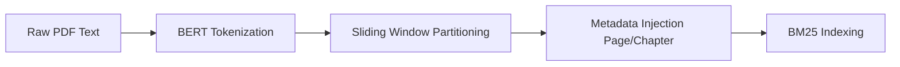

# 🧩 Chunking Strategy

## 📏 Parameters
- **Strategy**: Token-Aware Sliding Window
- **Chunk Size**: 300 tokens (BERT-aligned)
- **Overlap**: 50 tokens
- **Tokenizer**: `bert-base-uncased` (WordPiece)

## 🧠 Rationale
NCERT Science textbooks contain high-density information including formulas and specific terminology. Standard character-based chunking often breaks formulas across chunks. 
By using a **token-aware sliding window**, we ensure:
1. **Formula Integrity**: Chunks are large enough to keep most physics derivations contiguous.
2. **Pedagogical Context**: The 50-token overlap ensures that the definition (concept) and its application (example) are bridged across retrieval windows.
3. **Truncation Prevention**: Keeping chunks at 300 tokens (well below the 512 BERT limit) ensures no tokens are lost during the vectorization/retrieval phase.

## 📊 Flowchart

